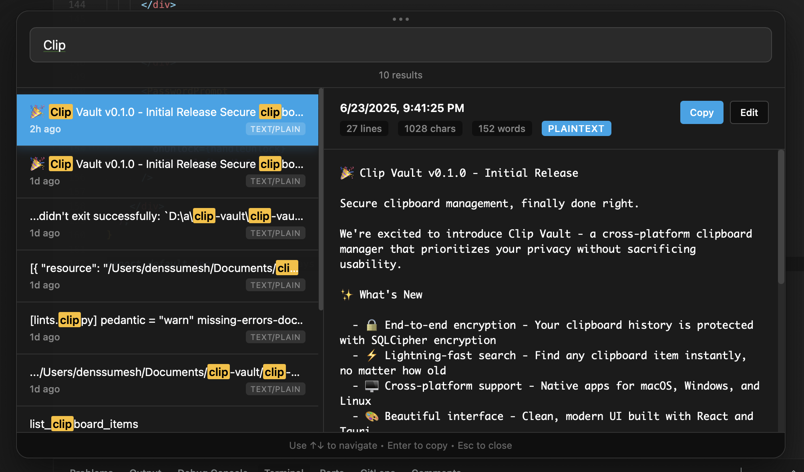

# Clip Vault

A secure, cross-platform clipboard manager built with Rust and Tauri. Clip Vault automatically captures and encrypts your clipboard history, making it searchable and accessible with a beautiful modern interface.



## Features

- 🔒 **End-to-end encryption** - All clipboard data is encrypted using SQLCipher
- 🖥️ **Cross-platform** - Works on macOS, Windows, and Linux
- 🔍 **Fast search** - Quickly find clipboard items from your history
- 🎨 **Modern UI** - Beautiful, responsive interface built with React and Tauri
- 🔄 **Background monitoring** - Automatically captures clipboard changes
- 📱 **Portable** - Single executable with no external dependencies
- 🚀 **Lightweight** - Minimal system resource usage
- 🎯 **Toast notifications** - Visual feedback when copying items
- 🚀 **Onboarding flow** - Guided setup for new users
- ⚡ **Global hotkeys** - Access your clipboard from anywhere
- 🔧 **Settings management** - Customizable preferences and shortcuts

## Installation

### Pre-built Binaries

Download the latest release for your platform from the [Releases page](https://github.com/densumesh/clip-vault/releases).

### Building from Source

Requirements:
- Rust 1.70+
- Node.js 18+
- Yarn

```bash
# Clone the repository
git clone https://github.com/densumesh/clip-vault.git
cd clip-vault

# Build the CLI tools
cargo build --workspace --release

# Build the desktop app
cd clip-vault-app
yarn install
yarn build
yarn tauri build
```

## Quick Start

### Command Line Interface

1. **Setup your vault password:**
   ```bash
   clip-vault setup
   ```

2. **View your latest clipboard item:**
   ```bash
   clip-vault latest
   ```

3. **List all clipboard history:**
   ```bash
   clip-vault list
   ```

### Desktop Application

Launch the Clip Vault app from your applications folder or run:
```bash
# Development mode
cd clip-vault-app
yarn tauri dev

# Or run the built binary
./target/release/clip-vault-app
```

The app will guide you through initial setup with an onboarding flow, then run in the background with system tray access.

## Architecture

Clip Vault is built as a Rust workspace with integrated components:

### Core Components

- **`clip-vault-core`** - Core library with encryption, storage, and data models
- **`clip-vault-cli`** - Command-line interface for interacting with your vault
- **`clip-vault-app`** - Desktop GUI application with integrated background monitoring

### Key Technologies

- **Backend**: Rust with SQLCipher for encrypted storage
- **Frontend**: React with TypeScript and Vite
- **Desktop**: Tauri for cross-platform native apps
- **Encryption**: SQLCipher with password-based encryption
- **CLI**: Clap for command-line argument parsing

## Configuration

### Environment Variables

- `CLIP_VAULT_KEY` - Vault password (bypasses interactive prompt)

### File Locations

- **Database**: `{data_dir}/clip-vault/clip_vault.db`
- **Session cache**: `{cache_dir}/clip-vault/session.json`

## Development

### Project Structure

```
clip-vault/
├── clip-vault-core/     # Core library (encryption, storage)
├── clip-vault-cli/      # Command-line interface
├── clip-vault-tests/    # Integration tests
├── clip-vault-app/      # Desktop application
│   ├── src/            # React frontend
│   └── src-tauri/      # Tauri backend
└── .github/workflows/   # CI/CD pipelines
```

### Development Commands

```bash
# Check all workspace crates
cargo check --workspace

# Build all crates
cargo build --workspace

# Run CLI (requires setup first)
cargo run -p clip-vault-cli -- setup
cargo run -p clip-vault-cli -- latest

# Run desktop app in development
cd clip-vault-app
yarn tauri dev
```

### Testing

```bash
# Run all tests
cargo test --workspace

# Run specific crate tests
cargo test -p clip-vault-core
```

## Security

- All clipboard data is encrypted using SQLCipher with AES-256 encryption
- Passwords are never stored in plaintext
- Session tokens use secure random generation
- Memory is cleared after use where possible
- Database files are encrypted at rest

## Contributing

1. Fork the repository
2. Create a feature branch (`git checkout -b feature/amazing-feature`)
3. Commit your changes (`git commit -m 'Add some amazing feature'`)
4. Push to the branch (`git push origin feature/amazing-feature`)
5. Open a Pull Request

## License

This project is licensed under the MIT License - see the [LICENSE](LICENSE) file for details.

## Acknowledgments

- [Tauri](https://tauri.app/) - For the excellent cross-platform framework
- [SQLCipher](https://www.zetetic.net/sqlcipher/) - For secure database encryption
- [Arboard](https://github.com/1Password/arboard) - For cross-platform clipboard access